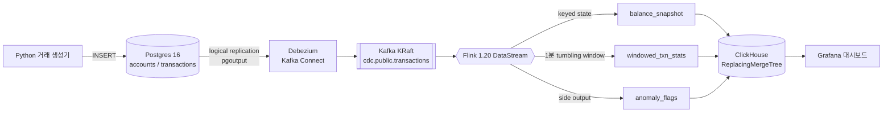
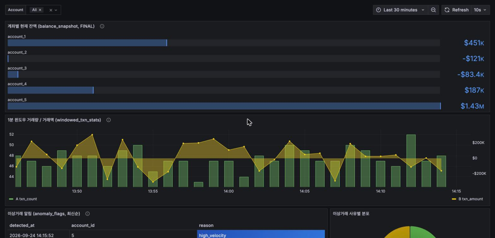
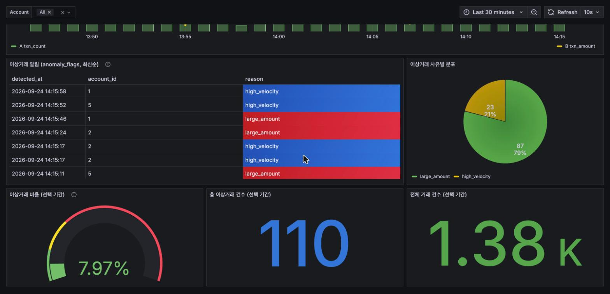

# realtime-txn-pipeline

**코어뱅킹 DB의 거래를 CDC로 실시간 스트림화하고, Flink로 잔액·집계·이상거래를 계산해 ClickHouse/Grafana로 서빙하는 파이프라인.**
단순히 "돌아가는" 것을 넘어, 결과가 원본과 **정확히 일치함을 대조·통계로 증명**하고 그 과정에서 만난 장애 3건의 근본 원인을 추적한 기록을 함께 담았다.






## 핵심 성과

| 항목 | 결과 |
|---|---|
| 1분 윈도우 집계 vs Postgres 원본 | 대조한 11개 윈도우 **전부 건수·금액 정확히 일치** |
| 계좌별 잔액 vs Postgres 누적합 | 5개 계좌 **전부 정확히 일치** |
| 이상거래 비율 (n=642) | large_amount 실측 4.05% / 이론값 5.00%, high_velocity 실측 2.34% / 시뮬레이션값 2.06% — 둘 다 **Wilson 95% 신뢰구간 내** |
| 연속 가동 안정성 | 약 4시간 48분, 체크포인트 86회, 예외 0건, **중복 적재 0건** |
| 장애 추적 | 오프셋 재처리 폭증, 워터마크 정지, **ClickHouse JDBC 드라이버 버그** 3건 근본 원인 규명·수정 |

## 기술 스택과 선택 이유

| 레이어 | 기술 | 선택 이유 |
|---|---|---|
| 소스 DB | Postgres 16 (`wal_level=logical`) | 코어뱅킹 DB 역할. 은행 실무의 "레거시 DB → 실시간 스트림" 패턴 재현 |
| CDC | Debezium 2.7 (pgoutput) | 외부 플러그인 없이 Postgres 내장 논리 복제 사용 |
| 메시징 | Kafka 3.9 (KRaft) | Zookeeper 없는 단일 노드 구성 |
| 스트림 처리 | Flink 1.20 DataStream API (Java 17) | `KeyedProcessFunction`으로 keyed state·타이머를 직접 다루기 위해 Table API 대신 선택 |
| OLAP | ClickHouse 24 | 실시간 집계 조회. `ReplacingMergeTree`로 스키마 레벨 멱등성 확보 |
| 시각화 | Grafana 11 | datasource·대시보드 모두 코드로 provisioning (UI 수동 설정 없음) |

상세한 대안 비교와 의사결정 근거는 [ARCHITECTURE_DECISIONS.md](ARCHITECTURE_DECISIONS.md) 참고.

## Flink 처리 로직

- **계좌별 잔액** — `accountId`로 keyBy 후 `ValueState`에 running balance 유지, 거래마다 `balance_snapshot`에 적재 (`ReplacingMergeTree(updated_at)`로 최신값만 유지)
- **1분 윈도우 집계** — event-time tumbling window, `forBoundedOutOfOrderness(5s)` + `withIdleness(30s)`
- **이상거래 룰** (side output)
  - `large_amount`: 거래 금액 절댓값 > 47,500
  - `high_velocity`: 같은 계좌에서 5초 내 4건 이상
- **장애 내성** — 10초 주기 체크포인트, 커밋된 오프셋에서 재개(`committedOffsets(EARLIEST)`)

## 트러블슈팅: 장애 3건과 근본 원인

### 1. 재시작할 때마다 이상거래 580만 건 폭증
- **증상**: `anomaly_flags`가 수 시간 만에 580만 행으로 증가, 같은 (계좌, 사유, 시각)이 약 1,200번 반복
- **원인**: Kafka source가 `OffsetsInitializer.earliest()`를 사용 → 세이브포인트 복원 없는 로컬 잡이 재시작마다 토픽 전체를 재처리
- **수정**: `committedOffsets(OffsetResetStrategy.EARLIEST)`로 변경해 체크포인트 때 커밋된 오프셋에서 재개

### 2. 1분 윈도우 집계가 영원히 0행
- **증상**: `windowed_txn_stats`에 한 행도 적재되지 않음
- **원인**: 초당 약 0.8건의 저트래픽에서 파티션이 자주 유휴 상태가 되어 워터마크가 전진하지 않음 → 윈도우가 한 번도 닫히지 않음
- **수정**: `withIdleness(30s)` 추가
- **부수 발견**: `KAFKA_CFG_NUM_PARTITIONS`는 Bitnami 이미지 전용 환경변수라 `apache/kafka` 이미지에선 무시되고 토픽이 1파티션으로 생성돼 있었음

### 3. ClickHouse 중복 적재 — 오진을 반증하고 드라이버 버그를 찾기까지
- **증상**: 중복 행이 계속 쌓이고, 오래된 행일수록 중복 배율이 커짐
- **1차 가설 (틀림)**: 서버가 닫은 HTTP keep-alive 커넥션 재사용 → 재시도로 중복 INSERT. `http_keep_alive=false` 적용했으나 해결 안 됨
- **반증**
  - 드라이버 바이트코드를 확인해 보니 `ClickHouseDriver`는 기본적으로 V2 드라이버로 위임하고, `http_keep_alive`는 V2가 **참조조차 하지 않는** V1 전용 옵션
  - 라이브 재현 중 소켓 수는 고정, Flink 재시도 로그는 0건인데도 중복은 계속 발생
- **근본 원인**: `com.clickhouse:jdbc-v2:0.8.6`의 `PreparedStatementImpl`이 리터럴-VALUES 배치 INSERT 경로에서 `executeBatch()` 후 내부 배치 리스트를 비우지 않음 (JDBC 표준 계약 위반). Flink JDBC sink는 같은 `PreparedStatement`를 재사용하므로 **매 flush마다 과거 행 전체가 재전송**됨
- **업스트림 대조**: 독립적으로 규명한 뒤 확인해 보니 0.8.6 회귀 버그로 이미 보고([clickhouse-java#2548](https://github.com/ClickHouse/clickhouse-java/issues/2548))되어 v0.9.2에서 수정([#2549](https://github.com/ClickHouse/clickhouse-java/pull/2549))된 상태 — 진단이 메인테이너의 결론과 일치함을 확인
- **수정**: 1차로 `executeBatch()` 직후 `PreparedStatement`를 재생성하는 커스텀 executor를 만들어 우회 → 수정 전 8분 만에 중복 키 49개에서 4시간 48분 동안 **0개**로 확인. 이후 드라이버를 0.9.8로 올리고 우회 코드(88줄)를 삭제해 표준 `JdbcSink.sink`로 복귀
- **업그레이드 검증**: 15분 가동에서 중복 제거 없는 원본 테이블 기준 중복 키 **0개**, 1분 윈도우 70개(계좌×윈도우, 거래 672건)가 Postgres 원본과 **건수·금액 전부 일치**, 체크포인트 100회 예외 0건
- JDBC sink는 구조적으로 at-least-once이므로 `ReplacingMergeTree` + `FINAL` 조회를 방어선으로 유지

## 실행 방법

사전 요구사항: Docker, Java 17, Gradle, Python 3

```bash
# 1. 인프라 기동 (postgres, kafka, kafka-ui, kafka-connect, clickhouse, grafana)
cd infra && docker compose up -d && cd ..

# 2. 스키마 적용
docker exec -i txn-postgres psql -U bankuser -d bankdb < infra/schema.sql
docker exec -i txn-clickhouse clickhouse-client --multiquery < infra/clickhouse-schema.sql

# 3. Debezium 커넥터 등록
curl -X POST -H "Content-Type: application/json" \
  --data @infra/connector-config.json http://localhost:8083/connectors

# 4. Flink 잡 실행 (로컬 임베디드 클러스터)
cd flink-job && gradle run

# 5. 거래 생성기 실행 (별도 터미널)
cd generator && python3 -m venv .venv && source .venv/bin/activate
pip install -r requirements.txt && python generate_transactions.py
```

| 서비스 | 주소 |
|---|---|
| Grafana | http://localhost:3000 (admin / admin) |
| Kafka UI | http://localhost:8081 |
| Kafka Connect REST | http://localhost:8083 |
| ClickHouse HTTP | http://localhost:8123 |
| Postgres | localhost:5433 |

## 로드맵

- [x] clickhouse-java 0.9.8로 업그레이드하고 드라이버 버그 우회 코드 제거 (업스트림 #2548에서 수정됨)
- [ ] 테스트: Flink operator test harness 단위 테스트, Testcontainers E2E 정합성 테스트
- [ ] 장애 주입(Flink/Connect/ClickHouse 강제 종료) 후 정합성 자동 대조
- [ ] CDC `UPDATE`/`DELETE`(거래 정정·취소) 처리
- [ ] Kafka 파티션 수 반영 및 처리량·지연(p50/p99) 측정
- [ ] MinIO + Iceberg 레이크 적재 및 배치 재계산과 스트림 결과 대조
